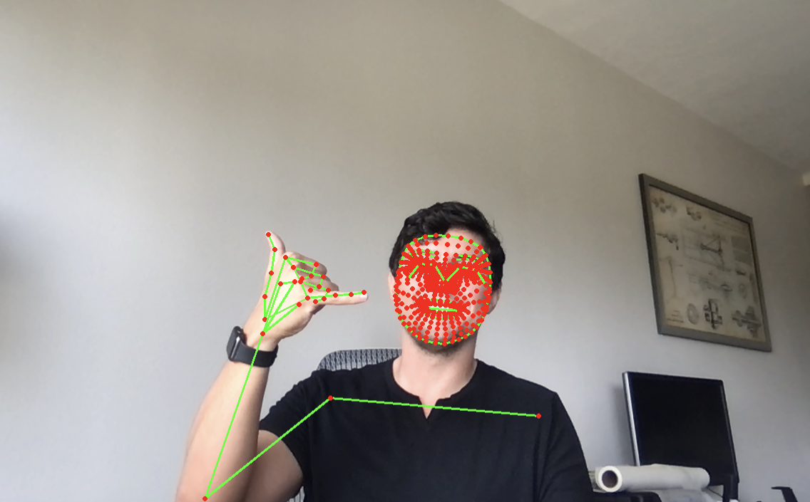
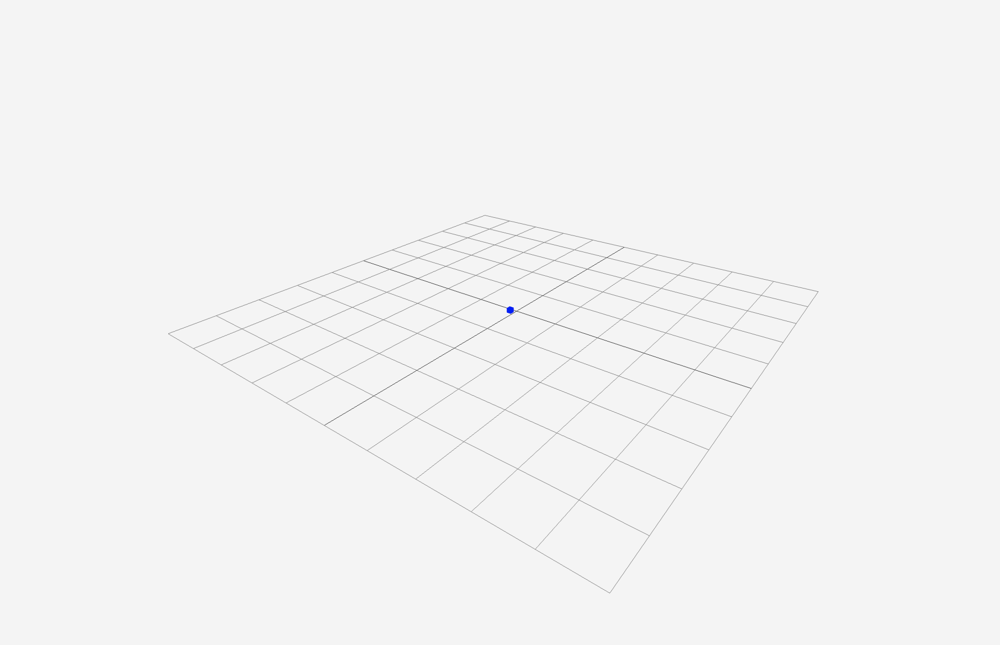

# python_NE_3d_body

Flash talk at [Python NE 2021](https://www.youtube.com/watch?v=qj5i9YvFYy8) - 3D Body recognition

Flash talk simples para mostrar o uso básico de [MediaPipe](https://google.github.io/mediapipe/solutions/holistic.html)



## Instalando Dependências

[Docs MediaPipe in Python](https://google.github.io/mediapipe/getting_started/python.html)

```sh
#criando virtual env
python3 -m venv mp_env && source mp_env/bin/activate

#instale mediapipe
pip install mediapipe

#instale opencv-python
pip install opencv-python
```

### OpenCV

OpenCV (CV = Computer Vision) é uma biblioteca usada pra pegar os dados (imagem) da webcam e desenhar as linhas e pontos em cima do feed da camera. Vale a pena aprender ;)

### Media Pipe

é um pipeline pra rodar modelos de Machine Vision (Machine Learning + Computer Vision) de forma simples


## Rodando os modelos com python

Agora que você instalou tudo, pra rodar é suave

```sh
#holistc model
python3 holistic.py

#objectron 
python3 objectron.py
```

Obs: se você tem mais de uma webcam instalada olha

```py
# 0, 1 ...2 depende de qual webcam você quer usar
cap = cv2.VideoCapture(0)
```

### Visualizando dados
```sh
cd ./3d-view
#install dependencies
yarn
# run the ui
yarn dev

# open: localhost:1234
```


```json
[
{x: 0.6653528213500977, y: 0.4402438700199127, z: -0.31725406646728516, v: 0.999646008014679},
{x: 0.6729506254196167, y: 0.3967844545841217, z: -0.2718436121940613, v: 0.9997053146362305},
{x: 0.6775661706924438, y: 0.4004194140434265, z: -0.27127593755722046, v: 0.9992713928222656}
]
/*... 33 points*/
```
